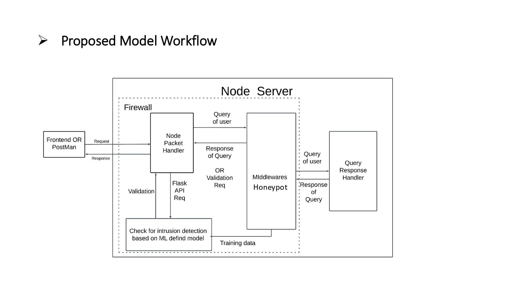
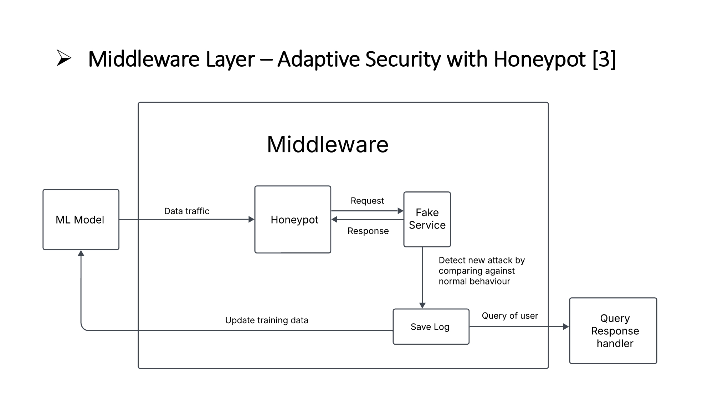

# NIDS - An Advanced Two-Layer Network Intrusion Detection System

This project implements a sophisticated two-layer Network Intrusion Detection System (NIDS). It combines a high-speed, machine-learning-based detection layer for known attack patterns with a high-interaction honeypot layer designed to capture and analyze zero-day exploits, creating a feedback loop for continuous model improvement.

This repository contains the full implementation, including the ML-powered API, a Node.js packet capture service, a React frontend dashboard, and the data science notebooks used for model training.

---

## System Architecture

The system is designed in two primary layers to provide both speed and depth of analysis.

- **Layer 1 (ML / Signature Layer)**: A real-time, low-latency detection service that analyzes network flow statistics. It uses a supervised machine learning model to classify traffic as benign or malicious based on known or statistically similar attack patterns.

- **Layer 2 (Honeypot)**: A honeypot subsystem that lures and "detains" suspicious traffic flagged by Layer 1. It captures detailed payloads and attacker behavior, providing invaluable, high-quality labeled data for analyzing new attack vectors and retraining the Layer 1 model.

### Visual Overview

**Full System Two-Layer Design:**  


**Honeypot / Middleware Data-Flow:**  


---

## Project Structure

This repository is organized into the following key directories:

- **`src/`**: Contains all active source code for the three main components of the system.
  - **`src/backend/`**: A Node.js application responsible for real-time network packet capture. It captures live traffic, formats it into the required JSON structure (timestamps, IPs, ports), and forwards it to the Flask API for analysis.
  - **`src/flask-api/`**: The core Python/Flask API that serves as Layer 1 of the NIDS. It receives packet data from the Node.js backend, extracts 12 time-based features, and uses a trained LightGBM model (`model.pkl`) to return a real-time attack prediction.
  - **`src/frontend/my-app/`**: A React application, bootstrapped with Create React App, which serves as the administrative and monitoring dashboard. It is designed to visualize live alerts, system health, and threat statistics.

- **`Colab-Work/`**: Contains the Jupyter/Colab notebooks and supporting files used for all data science and model development tasks. This includes data preprocessing, feature engineering, model selection (LightGBM), training, and evaluation that ultimately produces the `model.pkl` artifact used by the Flask API.

- **`architecture/`**: Contains the architecture diagrams and supporting visuals, including `nids_architecture.jpg` and `middleware_architecture.jpg`.

---

## Core Features: The ML Detection Model

The high-speed detection in Layer 1 is powered by a machine learning model that analyzes **12 time-based features** extracted from packet flows. It does not rely on deep packet inspection, making it extremely fast and lightweight.

### The features analyzed include:

- Flow Duration
- Forward Inter-Arrival Time (Std, Mean, Max, Total)
- Backward Inter-Arrival Time (Std, Mean, Max, Total)
- Flow Inter-Arrival Time (Std, Mean, Max)
- Idle Time statistics

---

## How to Run the System

The system is fully containerized for easy deployment. The recommended method is using Docker and Docker Compose.

### Prerequisites

- Docker
- Docker Compose

### Recommended: Running with Docker Compose

The Flask API is configured to run with Docker Compose.

1. Ensure your trained model file (`model.pkl` from `Colab-Work/`) is placed in the `src/flask-api/app/models/` directory.

2. Navigate to the `src/flask-api/` directory.

3. Build and start the container in detached mode:
   ```bash
   docker-compose up -d
   ```

4. Check that the service is running and healthy:
   ```bash
   curl http://localhost:5000/health
   ```

5. To stop the service:
   ```bash
   docker-compose down
   ```

---

## Running Individual Components

You can also run each component locally for development.

### 1. Flask API (Layer 1):

```bash
# Navigate to the API directory
cd src/flask-api/

# Install requirements
pip install -r requirements.txt

# Run the application
python run.py
```

### 2. Node.js Backend (Packet Capture):

```bash
# Navigate to the backend directory
cd src/backend/

# Install dependencies
npm install

# Start the packet capture and forwarding service
npm start
```

### 3. React Frontend (Dashboard):

```bash
# Navigate to the frontend directory
cd src/frontend/my-app/

# Install dependencies
npm install

# Run the app in development mode
npm start
```

The app will be available at `http://localhost:3000`.

---

## API Usage

To get a prediction, send a POST request to the `/predict` endpoint with an array of packet objects. The API will process the array and return a single prediction for the entire flow.

**Endpoint:** `POST /predict`

### Request Body (JSON):

```json
[
  {
    "timestamp": "2025-03-19T15:43:22.123456",
    "src_ip": "192.168.1.100",
    "dst_ip": "172.16.0.5",
    "src_port": 54321,
    "dst_port": 80
  },
  {
    "timestamp": "2025-03-19T15:43:22.234567",
    "src_ip": "172.16.0.5",
    "dst_ip": "192.168.1.100",
    "src_port": 80,
    "dst_port": 54321
  }
]
```

### Success Response (JSON):

```json
{
  "prediction": 1,       
  "is_attack": true     
}
```

- **`prediction`**: The raw model output (0 for normal traffic, 1 for attack).
- **`is_attack`**: A boolean flag for easy conditional logic in client applications.

---

## Configuration

The API's behavior can be configured via environment variables (for Docker) or a `config.py` file (for local runs).

| Variable | config.py | Default | Description |
|----------|-----------|---------|-------------|
| `MODEL_PATH` | `MODEL_PATH` | `app/models/model.pkl` | Path to the trained .pkl model file. |
| `IDLE_THRESHOLD` | `IDLE_THRESHOLD` | `1000000` | Time in microseconds to consider a gap as idle. |
| `PREDICTION_THRESHOLD` | `PREDICTION_THRESHOLD` | `0.5` | Probability threshold to classify as an attack. |

---

## Future Work

This project provides a strong foundation for a production-grade, self-improving NIDS. Future enhancements include:

- **Production Data Pipeline**: Integrate Kafka or other message queues for robust, scalable data ingestion from network TAPs to the backend service.

- **Automated Retraining**: Build a complete MLOps pipeline to automatically trigger model retraining and validation when the honeypot captures and labels a significant number of new attack signatures.

- **Explainability & Drift**: Integrate SHAP or LIME for model explainability and add detection for model drift to identify when the Layer 1 model is becoming stale against new traffic patterns.

- **Honeypot Deployment**: Replace the simulated honeypot with a fully instrumented, scalable, low-interaction or high-interaction honeypot service deployed in a containerized environment.

---
